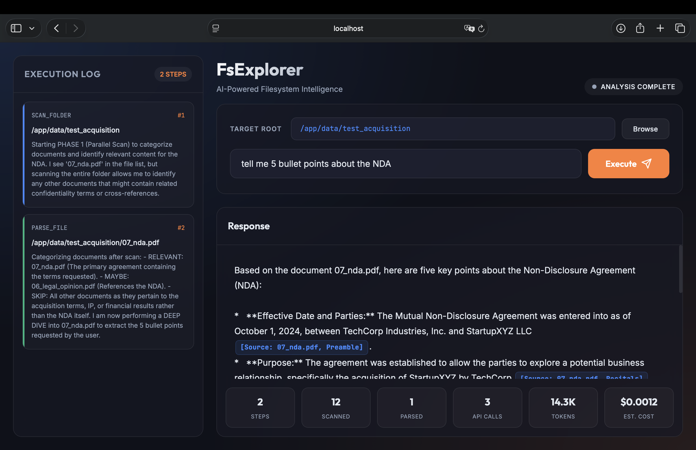

# FsExplorer — Agentic File Search

> **An AI-powered document intelligence agent that explores your filesystem, parsing PDFs and answering complex questions with citations.**



## 🚀 Key Features

*   **Intelligent Exploration**: Unlike traditional RAG, FsExplorer navigates folders, follows cross-references ("See Exhibit B"), and actively searches for answers.
*   **Deep Document Understanding**:
    *   **PDF & OCR**: Powered by `Docling`, `Tesseract`, and `Poppler` to read scanned documents and complex PDFs.
    *   **Multi-format**: Supports DOCX, PPTX, XLSX, HTML, Markdown, and source code.
*   **Modern Web UI**: A beautiful, glassmorphic interface with:
    *   Real-time execution logs (streaming WebSocket).
    *   Step-by-step reasoning visualization.
    *   Clean, cited final answers.
*   **Dockerized Deployment**: Fully containerized environment with all system dependencies pre-installed.
*   **Cost Effective**: Uses Google Gemini 3 Flash for high speed and low cost (~$0.001 per query).

## 🛠️ Tech Stack

*   **AI Core**: Google Gemini 3 Flash (via `google-genai` SDK)
*   **Orchestration**: LlamaIndex Workflows (Event-driven architecture)
*   **Parsing**: Docling + Tesseract OCR
*   **Backend**: FastAPI + WebSockets
*   **Frontend**: Vanilla JS + CSS (Glassmorphism design)
*   **Infrastructure**: Docker + Docker Compose

## 📦 Installation

### Prerequisites

*   **Docker** and **Docker Compose** installed.
*   A **Google Gemini API Key** (Get one [here](https://aistudio.google.com/apikey)).

### Quick Start (Docker)

1.  **Clone the repository**:
    ```bash
    git clone https://github.com/Taveren7/agentic-file-search-pro.git
    cd agentic-file-search-pro
    ```

2.  **Configure Environment**:
    Create a `.env` file in the root directory:
    Or simply rename the `.env.example` file to `.env` and fill in the values.
    ```bash
    GOOGLE_API_KEY=your_actual_api_key_here
    ```

    **Alternative**: You can also export the key in your shell instead of using a file:
    ```bash
    export GOOGLE_API_KEY=your_key_here
    docker-compose up
    ```

3.  **Run with Docker**:
    ```bash
    docker-compose up -d --build
    ```
    *Note: The first build may take a few minutes to compile OCR dependencies.*

    Open your browser to: **http://localhost:8000**

### 📂 Mounting Your Own Folders

To explore folders outside of the project directory (e.g., your Documents or a separate data drive), you can "plug them in" via environment variables:

1.  **Set the path**: Add this to your `.env` (or run it in your shell):
    *   **Mac/Linux**: `HOST_DATA_PATH=/Users/yourname/Documents/Work`
    *   **Windows**: `HOST_DATA_PATH=C:\Users\yourname\Desktop\ProjectData`
2.  **Restart**: Run `docker-compose up -d`.
3.  **Explore**: In the Web UI, you will see a folder named **`external_data`**. Open it to search your host files!

### 🔌 Connecting Multiple External Drives (Advanced)

To mount **multiple** folders (e.g., your "Work" folder, a "Personal" drive, and a "Network Share") at the same time:

1.  **Create an Override File**:
    Copy the example file:
    ```bash
    cp docker-compose.override.example.yml docker-compose.override.yml
    ```
    *(Note: Docker automatically looks for `docker-compose.override.yml` and merges it with the main config.)*

2.  **Edit the File**:
    Open `docker-compose.override.yml` and uncomment/add your paths under `volumes`:
    ```yaml
    volumes:
      - /Users/me/Documents/Work:/app/external_data/Work_Docs
      - /Volumes/TeamShare/Q4_Reports:/app/external_data/Q4_Reports
    ```

3.  **Restart**:
    ```bash
    docker-compose up -d
    ```
    You will now see `Work_Docs` and `Q4_Reports` as subfolders inside `external_data`.

### 🛑 Stopping the App

To stop the background containers, run:
```bash
docker-compose down
```

## 📖 Usage Guide

### Using the Web UI

1.  **Select Target**: Use the folder picker to select the directory you want to analyze (Docker mounts the current directory to `/app` by default).
2.  **Ask a Question**:
    *   *Simple*: "Summarize the NDA in the contracts folder."
    *   *Complex*: "Compare the payment terms in the Acquisition Agreement vs the Financial Adjustments."
3.  **Watch it Work**: The agent will scan, preview, and deep-dive into files. It may even ask you follow-up questions if it gets stuck!

### CLI Mode (Optional)

You can also run the agent directly from the command line if you have `uv` installed:

```bash
uv run explore --task "Find all deadlines in the project_plan.pdf"
```

## 🔧 Troubleshooting

*   **"Connection failed"**: Ensure the Docker container is running (`docker-compose ps`).
*   **PDF Parsing Errors**: If you see missing library errors, ensure you rebuilt the container (`docker-compose up --build`) which installs `libGL` and `poppler`.


### 🆚 Comparisons: Why FsExplorer?

#### 1. FsExplorer vs. Traditional RAG
Standard RAG (Retrieval-Augmented Generation) is a **"Search Engine"**:
*   **Process**: Vector Search → Retrieve Chunks → Summarize.
*   **Weakness**: It "chunks" files, losing context. If a contract says *"See Exhibit B for pricing"*, RAG won't know to go find Exhibit B unless it also matches your search keywords.
*   **Best For**: Sub-second answers from millions of simple docs.

FsExplorer is a **"Research Assistant"**:
*   **Process**: Parallel Scan → Deep Dive → **Backtrack**.
*   **Strength**: It behaves like a human. It opens a folder, scans file names, reads a document, *notices a cross-reference*, and **actively backtracks** to open the referenced file.
*   **Best For**: Complex analysis of legal contracts, codebases, or research papers where relationships between files matter.

#### 2. FsExplorer vs. Coding Agents (OpenCode, Cursor, etc.)
General-purpose coding agents are designed to **write code**. FsExplorer is designed to **conduct research**.

| Feature | Coding Agents (OpenCode/Cursor) | FsExplorer (This Agent) |
| :--- | :--- | :--- |
| **Primary Goal** | Write/Edit Code & Fix Bugs | **Answer Questions & Synthesize Data** |
| **Citation Style** | Loose ("In the utils file...") | **Strict** (`[Source: utils.py, Line 45]`) |
| **Parsing** | Text-based (Code-focused) | **Docling-powered** (OCR for PDFs, Tables in DOCX) |
| **Token Tracking** | Opaque / Hidden | **Transparent** (Real-time $$$ cost per query) |
| **Architecture** | Linear / ReAct Loop | **State Machine** (Scan → Deep Dive → Backtrack) |

### 🏆 Pro-Level Research Features
*   **Strict Citations**: Every claim is backed by a specific source: *"The fee is $500 [Source: contract.pdf, Section 4]"*.
*   **Real-Time Token Auditing**: The agent calculates and displays the exact cost of every query (e.g., *"$0.012"*) so you can manage your budget.
*   **Visual Logic**: Watch the agent's "brain" work in the UI as it decides to *SKIP* irrelevant files or *DEEP DIVE* into promising ones.

## 📜 License

MIT License. See [LICENSE](LICENSE) for details.

---

*Based on the original [fs-explorer](https://github.com/run-llama/fs-explorer) concept by LlamaIndex and the [agentic-file-search](https://github.com/PromtEngineer/agentic-file-search) implementation by PromptEngineer.*
